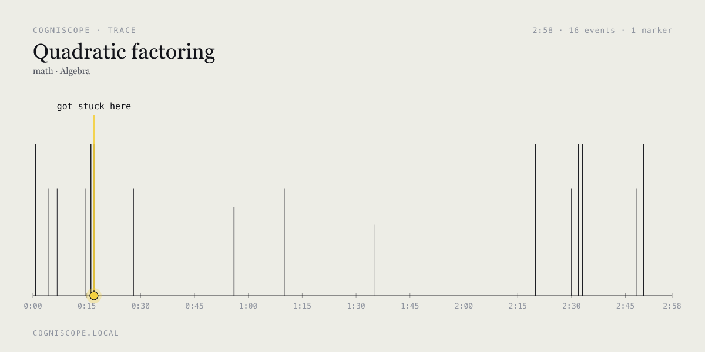

# Cogniscope

A learning lab that analyzes your **process**, not just your answers.



Self-learners solve math/programming problems while behavior is silently
captured (focus, edits, idle, hints, tab-switches, paste, full screen
recording via rrweb). An LLM pipeline then classifies cognitive state,
diagnoses root causes, and produces a personalized feedback report plus
a Socratic tutor chat.

## Local setup

```bash
pnpm install
cp .env.example .env.local
# Optionally set GEMINI_API_KEY (or QWEN_API_KEY) and LLM_PROVIDER accordingly
pnpm dev
```

Open http://localhost:3000.

To populate `/history` with realistic demo data:

```bash
pnpm seed
```

## Demo script

After `pnpm seed`, the current rehearsed sessions are:

- `seed-Oj2Q1Zvp` — Quadratic factoring
- `seed-JQnlgkUY` — Chain rule derivative
- `seed-2hzj1khv` — Two Sum
- `seed-ofjiFV3x` — Integration by parts

Suggested live click path:

1. Open `/history` and point out the four seeded sessions.
2. Open `/report/seed-Oj2Q1Zvp` to show the reading, by-step timeline, replay, tutor, recommendations, and share-trace actions.
3. Open `/inspect/seed-Oj2Q1Zvp` to show the raw stored `sessions`, `events`, `reports`, and rrweb file metadata.
4. Open `/report/seed-2hzj1khv` to show the programming flow and discuss that `Run local tests` executes in-browser, while `Submit & analyze` stores the code and behavior trace for analysis.
5. Hit `/api/sessions/seed-Oj2Q1Zvp/trace.png` if you want a fast proof that export works end-to-end.

If you re-run `pnpm seed`, these ids will change; use `/history` as the source of truth.

## Configuration

| Env | Values | Default | Notes |
|-----|--------|---------|-------|
| `LLM_PROVIDER` | `mock`, `gemini`, `qwen` | `mock` | |
| `GEMINI_API_KEY` | — | — | Required when provider = gemini |
| `GEMINI_MODEL` | e.g. `gemini-2.5-flash` | `gemini-2.5-flash` | Override at will |
| `QWEN_API_KEY` | — | — | Required when provider = qwen (DashScope key) |
| `QWEN_MODEL` | e.g. `qwen-plus` | `qwen-plus` | DashScope model id |
| `QWEN_BASE_URL` | — | DashScope compat URL | Override for a custom OpenAI-compat host |

Without an API key the app falls back to deterministic mock analysis — useful
for offline development.

Product analytics is handled by **Novus.ai → Pendo**, installed via Novus's
web UI (which is wired to this GitHub repo). No env var or install snippet
lives in the codebase; the agent is injected at runtime. The app fires a
handful of typed custom events via `track()` in [src/lib/pendo.ts](src/lib/pendo.ts)
which no-op gracefully when the agent isn't present.

## Routes

- `/` — problem catalog with sample trace hero
- `/practice/[id]` — interactive practice with telemetry + screen recording
- `/analysis/[sessionId]` — analyzer status
- `/report/[sessionId]` — Reading / By step / Replay / Tutor tabs + Try-next recommendations + share-trace PNG
- `/history` — past sessions
- `/styleguide` — internal design system reference
- `/api/sessions/[id]/trace.png` — server-rendered PNG of the trace for sharing (`?format=svg` for SVG)

## Architecture

```
Practice surface ──► BehaviorRecorder (rrweb + custom emitter)
                  ──► /api/events            ──► SQLite
                  ──► /api/sessions/:id/rrweb ──► data/sessions/<id>.rrweb.jsonl

Submit ──► /api/sessions/:id/submit
       ──► /api/analyze ──► extractFeatures()
                        ──► LLM.completeJSON(behavior tagging)
                        ──► LLM.completeJSON(diagnosis)
                        ──► LLM.complete(feedback markdown)
                        ──► reports table

Report views   ◄── reports + events + rrweb file
Tutor chat     ──► /api/chat ──► streaming with full report context
Share trace    ──► /api/sessions/:id/trace.png (server-side SVG via resvg)
```

## Stack

Next.js 14 (App Router) · TypeScript · Tailwind · better-sqlite3 · rrweb +
rrweb-player · Monaco · KaTeX · `@resvg/resvg-js` · Gemini SDK · sonner

## Out of scope for v0.1

Authentication, multi-user, code-execution sandbox, real-time nudges, production deploy.
