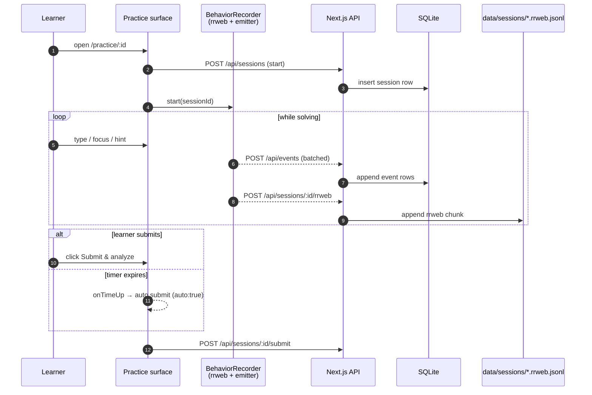
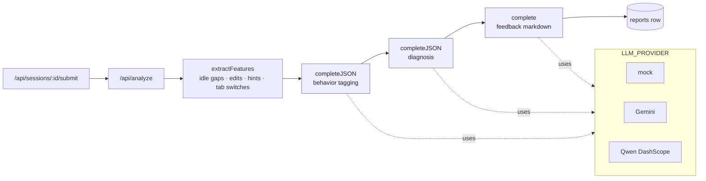
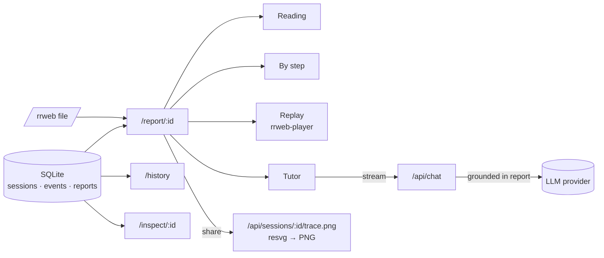

# Cogniscope

[](LICENSE)
[](https://nextjs.org/)
[](https://www.typescriptlang.org/)
[](https://tailwindcss.com/)
[](https://github.com/WiseLibs/better-sqlite3)
[](https://www.rrweb.io/)
[](https://microsoft.github.io/monaco-editor/)
[](https://katex.org/)
[](https://ai.google.dev/)
[](https://dashscope.aliyun.com/)
[](https://pnpm.io/)

A learning lab that analyzes your **process**, not just your answers.


Self-learners solve math/programming problems while behavior is silently
captured (focus, edits, idle, hints, tab-switches, paste, full screen
recording via rrweb). An LLM pipeline then classifies cognitive state,
diagnoses root causes, and produces a personalized feedback report plus
a Socratic tutor chat.

## Local setup

```bash
pnpm install
cp .env.example .env.local
# Optionally set GEMINI_API_KEY (or QWEN_API_KEY) and LLM_PROVIDER accordingly
pnpm dev
```

Open http://localhost:3000.

To populate `/history` with realistic demo data:

```bash
pnpm seed
```

## How it works

Three workflows, in the order a learner experiences them.

### 1 · Practice — silent capture

Every keystroke, focus change, hint, and full DOM frame streams out of the
browser while the timer counts down toward the per-question cap.



### 2 · Analyze — three LLM stages, one report row

Submit triggers a deterministic feature pass, then three grounded LLM calls.
Each call's JSON is validated; on failure the analyzer retries with a longer
context window, and finally falls back to a mock so the report always lands.



### 3 · Report — read, replay, ask

The report surface stitches the SQLite report row, the raw events, and the
rrweb file into four tabs. The Tutor tab streams a Socratic chat grounded in
*this* session's report, never a generic textbook.




## License

[MIT](LICENSE) © 2026 Jian Feng.

## Out of scope for v0.1

Authentication, multi-user, code-execution sandbox, real-time nudges, production deploy.
